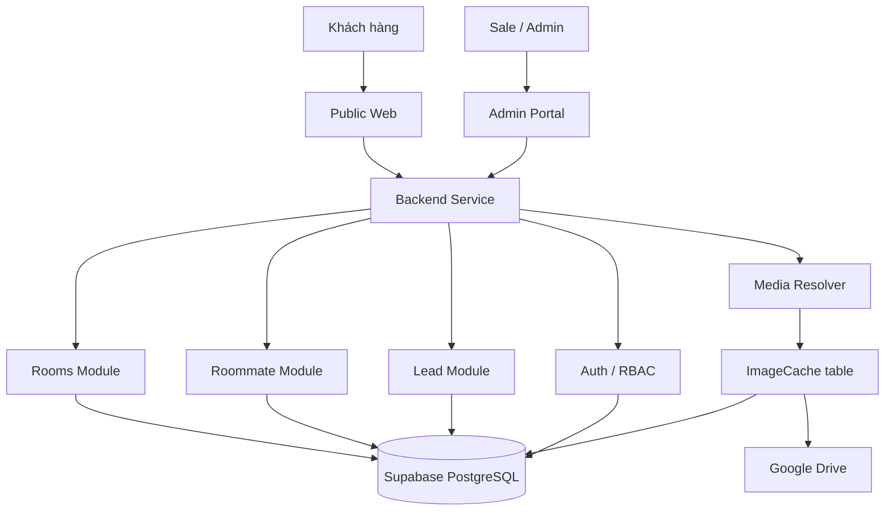

# Target Architecture

## Goal

Mục tiêu của kiến trúc đích là tách rõ:

- public experience cho khách
- internal portal cho sale/admin
- backend service cho nghiệp vụ và dữ liệu

Trong mô hình này, client không truy cập trực tiếp Supabase hay Google Drive.
Tất cả đều đi qua backend service.

## High Level View

## Core Principles

- One backend boundary for all clients.
- Supabase stays as the main database.
- Google Drive stays as the image source.
- Public and admin share domain models, but not UI responsibilities.
- Domain logic lives in backend modules, not in page components.

## Domain Boundaries

### Rooms

- list rooms
- filter rooms
- view room detail
- update room data from admin
- resolve main image and gallery image URLs

### Roommates

- list roommate posts
- view post detail
- create/update post from admin or sale workflow
- track expiration status

### Leads

- create lead from contact action
- attach source type and source ID
- allow sale/admin to review leads later

### Auth

- role-based access for admin operations
- public endpoints remain read-first and limited
- internal endpoints require permission checks

## Data Ownership

- `Supabase PostgreSQL` owns business data.
- `ImageCache` owns path-to-URL mapping for images.
- `Google Drive` owns the actual media files.
- Backend service owns validation, orchestration, and response shape.

## What Changes Compared to Today

- `src/services/*` stops being frontend-facing logic.
- UI stops querying Supabase directly.
- Admin actions go through authenticated API endpoints.
- Image resolution becomes backend-controlled instead of client-controlled.

