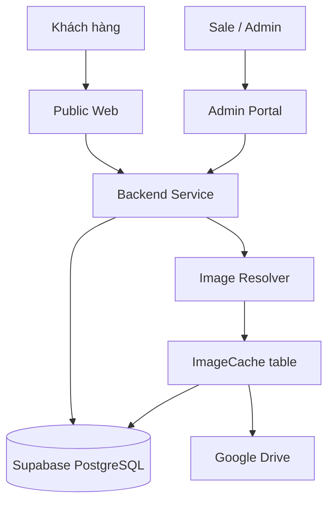

# HomeMatch Architecture & Migration Plan

Đây là index chính thức của thư mục. Bộ tài liệu mô tả quyết định cuối cùng: HomeMatch sẽ xây backend modular monolith trước, sau đó chỉ tách microservice khi có nhu cầu vận hành được chứng minh.

## Quyết định cuối cùng

```text
Public Web ─┐
Admin Portal ─┼── Backend API (modular monolith)
             ├── Auth/RBAC
             ├── Rooms
             ├── Roommates
             ├── Leads
             └── Media
                    ↓
             Supabase PostgreSQL
                    ↓
             ImageCache → Google Drive
```

Không xây TODO API, Users API, Redis, Worker, Traefik hay Zipkin trong phase đầu vì HomeMatch hiện chưa có use case tương ứng.

## Cách đọc theo thứ tự

1. `00-overview.md` — bối cảnh và phạm vi.
2. `07-final-architecture-decision.md` — quyết định kiến trúc bắt buộc.
3. `08-repository-and-module-structure.md` — cấu trúc code mục tiêu.
4. `09-api-contracts.md` — API boundary.
5. `10-auth-and-rbac.md` — authentication và phân quyền.
6. `11-data-access-and-security.md` — dữ liệu và bảo mật.
7. `12-local-development-and-docker.md` — local runtime.
8. `13-testing-and-quality.md` — quality gates.
9. `14-deployment-and-operations.md` — vận hành và release.
10. `15-phase-exit-criteria.md` — điều kiện hoàn thành.

Các file `01`–`06` giữ vai trò background, target design, trade-off, checklist và mapping với bài Todo microservices.

## File Index

- `00-overview.md`: bối cảnh, mục tiêu, scope, assumption
- `01-target-architecture.md`: kiến trúc đích và boundary giữa các khối
- `02-stack-decision.md`: stack công nghệ và lý do chọn
- `03-migration-phases.md`: các phase chuyển đổi
- `04-risks-and-tradeoffs.md`: rủi ro và mitigation
- `05-execution-checklist.md`: checklist để triển khai từng bước
- `06-service-mapping-for-homematch.md`: giải thích mapping giữa bài Todo microservices và HomeMatch
- `07-final-architecture-decision.md`: quyết định kiến trúc cuối cùng
- `08-repository-and-module-structure.md`: cấu trúc repository và backend modules
- `09-api-contracts.md`: hợp đồng API
- `10-auth-and-rbac.md`: authentication và role-based access
- `11-data-access-and-security.md`: boundary dữ liệu và bảo mật
- `12-local-development-and-docker.md`: local development và Docker decision
- `13-testing-and-quality.md`: chiến lược kiểm thử và quality gates
- `14-deployment-and-operations.md`: môi trường và vận hành
- `15-phase-exit-criteria.md`: tiêu chí hoàn thành từng phase

## Mục đích

- Lưu toàn bộ plan migration ở một nơi dễ tra cứu.
- Tách tài liệu chiến lược khỏi `task/` để tránh lẫn với session ngắn hạn.
- Làm nguồn tham chiếu duy nhất khi bắt đầu sửa kiến trúc.

## Sketch Tổng Quan



Sơ đồ trên là bản phác thảo nhanh của kiến trúc đích:

- public web và admin portal tách nhau
- backend service là điểm truy cập duy nhất cho dữ liệu
- Supabase giữ vai trò database
- Google Drive vẫn giữ vai trò image storage
