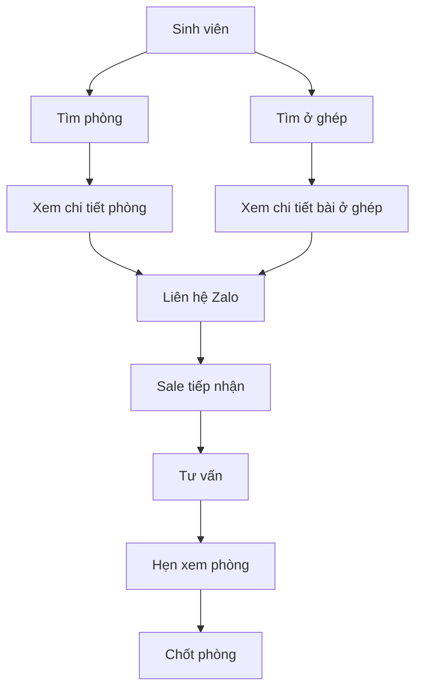

# Business Flow V1

## Product Goal

Mục tiêu của website:

- Giúp sinh viên tìm phòng trọ phù hợp.
- Giúp sinh viên tìm người ở ghép.
- Hỗ trợ đội sale tạo lead chất lượng.
- Tăng tỷ lệ chốt phòng thông qua tư vấn trực tiếp qua Zalo.

---

## Business Model

Website không phải là nền tảng tự phục vụ.

Website đóng vai trò:

- Hiển thị thông tin phòng trọ.
- Hiển thị nhu cầu ở ghép.
- Điều hướng người dùng sang Zalo.
- Đội sale tiếp nhận và xử lý toàn bộ quy trình tư vấn.

---

## Core Business Flow

website đóng vai trò thực hiện quá trình A --> B --> D --> F và A --> C --> E --> F

---

## Flow 1 - Tìm phòng

Sinh viên
→ Truy cập website
→ Tìm kiếm phòng
→ Xem chi tiết phòng
→ Bấm liên hệ Zalo
→ Sale tư vấn
→ Hẹn xem phòng
→ Chốt phòng

---

## Flow 2 - Tìm người ở ghép

Sinh viên
→ Truy cập website
→ Xem danh sách ở ghép
→ Xem chi tiết bài ở ghép
→ Bấm liên hệ Zalo
→ Sale hỗ trợ kết nối

---

## Flow 3 - Đăng nhu cầu ở ghép

Khách hàng
→ Liên hệ Sale thông qua Zalo

Sale
→ Thu thập thông tin, cung cấp thông tin cho Admin

Admin
→ Tạo bài ở ghép trên website dựa theo thông tin Sale cung cấp

Người khác (Khách hàng nói chung)
→ Xem bài đăng
→ Liên hệ Zalo
→ Sale hỗ trợ ghép

---

## Lead Generation Flow

Website
→ Hiển thị thông tin

Người dùng
→ Quan tâm phòng hoặc nhu cầu ở ghép

Người dùng
→ Bấm liên hệ Zalo

Sale
→ Tiếp nhận lead

Sale
→ Chốt phòng

---

## Success Metrics

### Website

- Tổng lượt truy cập
- Tổng lượt xem phòng
- Tổng lượt xem bài ở ghép

### Lead

- Số lượt click Zalo
- Số lead mới mỗi ngày
- Số lead theo từng phòng

### Sales

- Số lịch hẹn xem phòng
- Số phòng được chốt
- Tỷ lệ chuyển đổi từ lead sang khách thuê
