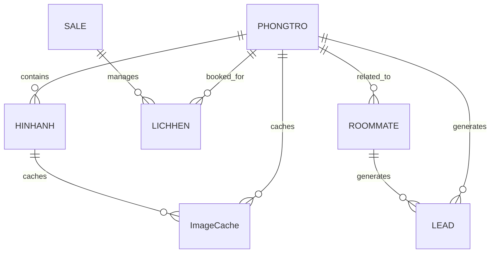

# DATABASE_STRUCTURE V5

## Tổng Quan

**Tên File:** DATABASE_HomeMatch

**Loại:** Supabase (PostgreSQL)

**URL:** `https://rccszqpjeikcjrfmbzpl.supabase.co`

**Mục đích:**

* Quản lý dữ liệu phòng trọ (PHONGTRO)
* Quản lý hình ảnh phòng (HINHANH)
* Quản lý nhu cầu ở ghép (ROOMMATE)
* Quản lý lịch hẹn khách xem phòng (LICHHEN)
* Quản lý nhân viên sale (SALE)
* Theo dõi lead phát sinh từ website (LEAD)
* Cache mapping path ảnh → URL (ImageCache)

**Kiến trúc hiện tại:**

```text
Supabase (Source of Truth)
        │
        ├── AppSheet (Sales Operations)
        │
        └── Website (Lead Generation via Supabase SDK)
```

---

# Database V4 Architecture



> **Lưu ý:** Tất cả tên table và column trong Supabase đều được lowercase tự động (VD: `PHONGTRO` → `phongtro`, `HinhAnhChinh` → `hinhanhchinh`).

---

# Bảng PHONGTRO

## Mục đích

Lưu trữ thông tin phòng trọ.

## Fields

| Field | Type | Description | Ghi chú |
|-------|------|-------------|---------|
| IDPhong | String | Mã phòng duy nhất | PK, do AppSheet tự sinh |
| MaPhong | String | Mã phòng rút gọn (VD: `P001`) | |
| HinhAnhChinh | String | Path ảnh đại diện (VD: `PHONGTRO_Images/abc.jpg`) | Resolve qua ImageCache |
| LoaiPhong | String | Loại phòng (VD: `Phòng trọ`, `Căn hộ`, `Studio`) | |
| SoNha | String | Số nhà | |
| Duong | String | Đường | |
| Phuong | String | Phường/Xã | |
| KhuVuc | String | Khu vực | VD: "Quận 7", "Thủ Đức" |
| HopDong | String | Loại hợp đồng | VD: "6-12 tháng" |
| Gia | Number | Giá thuê | Số (VD: 7000000) |
| DienTich | Number | Diện tích (VD: `25`, `30`) | Đơn vị m² |
| MayLanh | String | Có máy lạnh | "Có" / "Không" |
| KeBep | String | Có kệ bếp | "Có" / "Không" |
| Gac | String | Có gác | "Có" / "Không" |
| TuLanh | String | Có tủ lạnh | "Có" / "Không" |
| NhaVS | String | Có nhà vệ sinh | "Riêng" / "Chung" / "Không" |
| CuaSo | String | Có cửa sổ | "Có" / "Không" |
| BanCong | String | Có ban công | "Có" / "Không" |
| DeXe | String | Chỗ để xe | "Bãi để xe" / "Không" / "Có" |
| ThuCung | String | Cho phép thú cưng | "Có" / "Không" |
| XeDien | String | Hỗ trợ xe điện | "Có" / "Không" |
| GioGiac | String | Quy định giờ giấc | "Tự do" / "23h đóng cửa" |
| MayGiat | String | Có máy giặt | "Có" / "Không" / "Riêng" |
| ThangMay | String | Có thang máy | "Có" / "Không" |
| Lau | String | Tầng/lầu | VD: "Lầu 6" |
| Dien | String | Giá điện | VD: "3.800đ/kWh" |
| Nuoc | String | Giá nước | VD: "25.000đ/m3" |
| PhiQuanLy | String | Phí quản lý | VD: "130.000đ/phòng" |
| PhiGiuXe | String | Phí giữ xe | VD: "100.000đ/xe" |
| TienIch | Text | Mô tả tiện ích | |
| TrangThai | String | Trạng thái phòng | "Trống" / "Đã thuê" / "Ẩn" |
| HoaHong | String | Hoa hồng (cho Sale) | VD: "40-70%" |
| GhiChu | Text | Ghi chú | |
| IDChuNha | String | Link Zalo/Nhom chủ nhà | |
| Slug | String | URL SEO | Có thể để trống |
| NgayTao | DateTime | Ngày tạo | Do AppSheet tự ghi |
| NgayCapNhat | DateTime | Ngày cập nhật | Do AppSheet tự ghi |

## Giá trị TrangThai (thực tế)

| Giá trị | Ý nghĩa |
|---------|---------|
| Trống | Phòng trống, có thể cho thuê |
| Đã thuê | Phòng đã có người ở |
| Ẩn | Không hiển thị trên website |

> **Lưu ý:** TrangThai dùng tiếng Việt. Service map "Trống" → "ACTIVE".

---

# Bảng HINHANH

## Mục đích

Lưu danh sách hình ảnh của từng phòng.

## Fields

| Field | Type | Description |
|-------|------|-------------|
| IDAnh | String | Mã ảnh (PK) |
| IDPhong | String | Liên kết phòng (FK → PHONGTRO.IDPhong) |
| HinhAnh | String | Path ảnh (VD: `HINHANH_Images/xyz.jpg`) |
| SortOrder | Number | Thứ tự hiển thị |
| CreatedAt | DateTime | Ngày tạo |

## Quan hệ

```text
PHONGTRO (1)
    ↓
HINHANH (N)
```

---

# Bảng ImageCache

## Mục đích

Cache mapping path ảnh từ Google Sheet → Google Drive URL, giúp resolve nhanh mà không cần gọi Drive API mỗi lần.

## Fields

| Field | Type | Description |
|-------|------|-------------|
| path | String | Path gốc (VD: `PHONGTRO_Images/abc.jpg`) | PK |
| drive_url | String | Google Drive thumbnail URL | |
| updated_at | Timestamptz | Ngày cập nhật | |

## Cách hoạt động

1. Script `scripts/build-image-cache.ts` chạy 1 lần
2. Đọc tất cả path ảnh từ `PHONGTRO.HinhAnhChinh` và `HINHANH.HinhAnh`
3. Dùng Google Drive API (service account) tìm file → lấy thumbnail URL
4. Insert/Upsert vào `ImageCache`
5. Service `getRooms()` / `getRoomById()` query `ImageCache` để resolve path → URL

## RLS Policy

```sql
ALTER TABLE imagecache ENABLE ROW LEVEL SECURITY;

CREATE POLICY "anon_can_read_imagecache"
ON imagecache
FOR SELECT
TO anon
USING (true);
```

---

# Bảng ROOMMATE

## Mục đích

Lưu nhu cầu ở ghép hiển thị trên website.

## Business Rule

* Chỉ Admin được tạo bài đăng (qua AppSheet).
* Người dùng không được tự đăng bài.
* Thông tin được thu thập thông qua Sale.
* Mỗi bài đăng liên kết với một phòng trong hệ thống.

## Fields

| Field | Type | Description |
|-------|------|-------------|
| IDBai | String | Mã bài đăng (PK) |
| KieuBaiDang | String | Loại bài đăng |
| IDPhong | String | Mã phòng (FK → PHONGTRO.IDPhong) |
| TenKhachHang | String | Tên khách hàng |
| SDTKhach | String | Số điện thoại khách |
| SoNguoiCanTuyen | String | Số người cần tuyển |
| KhuVucMongMuon | String | Khu vực mong muốn |
| GioiTinh | String | Giới tính |
| SchoolOrWork | String | Trường học / Nơi làm việc |
| TaiChinh | String | Tài chính / Ngân sách |
| MoTaNhuCau | Text | Mô tả nhu cầu |
| TrangThai | String | Trạng thái |
| NgayTao | DateTime | Ngày tạo |
| ThoiHan | Date | Thời hạn |

## KieuBaiDang

```text
LOOKING_FOR_ROOMMATE  → Cần tìm người ở ghép
NEED_ROOMMATE_FOR_ROOM → Cần người thuê chung phòng
```

## TrangThai

```text
Đang hiển thị → ACTIVE
Đã kết thúc   → CLOSED
```

---

# Bảng LICHHEN

## Mục đích

Quản lý lịch hẹn xem phòng (do AppSheet quản lý).

> **Lưu ý:** Tab này do AppSheet tự động quản lý. Cấu trúc chi tiết cần đối chiếu với AppSheet.

## Fields (xác nhận)

| Field | Type | Description |
|-------|------|-------------|
| ID | String | Mã lịch hẹn (PK) |

> Các field khác do AppSheet quản lý (IDPhong, Khach, SDTKhach, NgayHen...).

---

# Bảng SALE

## Mục đích

Quản lý nhân viên sale.

## Fields

| Field | Type | Description |
|-------|------|-------------|
| IDSale | String | Mã sale (PK) |
| HoTen | String | Họ tên |
| ChucVu | String | Chức vụ |
| QLCTV | String | Quản lý CTV |
| STK | String | Số tài khoản |
| NganHang | String | Ngân hàng |
| SDT | String | Số điện thoại |
| Email | String | Email |

---

# Bảng LEAD

## Mục đích

Theo dõi lead phát sinh từ website.

## Fields (xác nhận)

| Field | Type | Description |
|-------|------|-------------|
| LeadID | String | Mã lead (PK) |
| SourceType | String | Loại nguồn: `ROOM` / `ROOMMATE` |
| SourceID | String | ID nguồn (IDPhong hoặc IDBai) |
| CreatedAt | DateTime | Ngày tạo |

---

# Quan Hệ Dữ Liệu

```text
PHONGTRO
├── HINHANH (1:N — qua IDPhong)
├── ImageCache (1:N — qua HinhAnhChinh path)
├── LICHHEN (1:N — qua IDPhong)
├── ROOMMATE (1:N — qua IDPhong)
└── LEAD (1:N — qua IDPhong)

SALE
└── LICHHEN (1:N — qua IDSale)

ROOMMATE
└── LEAD (1:N — qua IDBai)

HINHANH
└── ImageCache (1:N — qua HinhAnh path)
```

---

# MVP Scope

Website sử dụng:

* PHONGTRO — Hiển thị danh sách & chi tiết phòng
* HINHANH — Hiển thị hình ảnh phòng
* ROOMMATE — Hiển thị bài đăng ở ghép
* ImageCache — Resolve path ảnh → URL (phụ trợ)

AppSheet sử dụng:

* PHONGTRO — Quản lý phòng
* HINHANH — Quản lý ảnh
* LICHHEN — Quản lý lịch hẹn
* SALE — Quản lý sale
* ROOMMATE — Quản lý bài ở ghép

Analytics sử dụng:

* LEAD — Theo dõi lead

---

# Lịch sử thay đổi

| Version | Ngày | Thay đổi |
|---------|------|----------|
| V1 | 2026-06-13 | Cấu trúc thiết kế ban đầu (Google Sheet) |
| V2 | 2026-06-14 | Cập nhật sau Phase 2A code |
| V3 | 2026-06-16 | Đồng bộ với Google Sheet thật (DATABASE_HomeMatch) |
| V4 | 2026-06-23 | Migrate từ Google Sheet → Supabase, thêm ImageCache table |
| V5 | 2026-06-28 | Thêm cột MaPhong, LoaiPhong, DienTich vào PHONGTRO |
