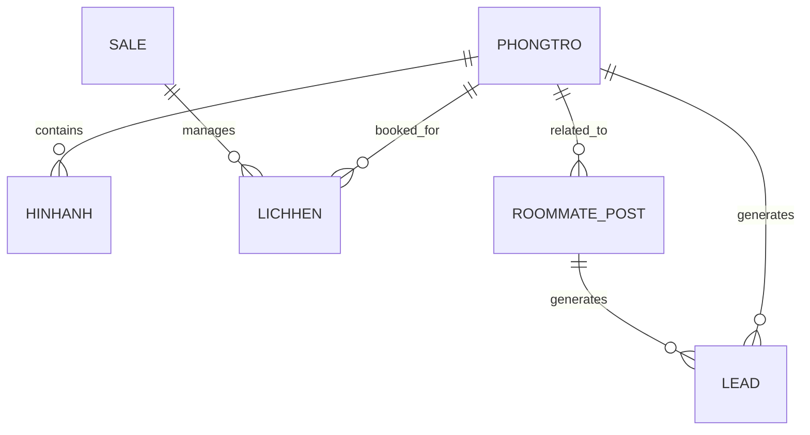

# DATABASE_STRUCTURE V2

## Tổng Quan

**Tên File:** DATABASE_FULL

**Loại:** Google Sheet

**Mục đích:**

* Quản lý dữ liệu phòng trọ.
* Quản lý hình ảnh phòng.
* Quản lý lịch hẹn khách xem phòng.
* Quản lý nhân viên sale.
* Quản lý nhu cầu ở ghép.
* Theo dõi lead phát sinh từ website.

**Kiến trúc hiện tại:**

```text
Google Sheet (Source of Truth)
        │
        ├── AppSheet (Sales Operations)
        │
        └── Website (Lead Generation)
```

---

# Database V1 Architecture



---

# Bảng PHONGTRO

## Mục đích

Lưu trữ thông tin phòng trọ.

## Fields

| Field     | Type     | Description       |
| --------- | -------- | ----------------- |
| IDPhong   | String   | Mã phòng duy nhất |
| SoNha     | String   | Số nhà            |
| Duong     | String   | Đường             |
| Phuong    | String   | Phường/Xã         |
| KhuVuc    | String   | Khu vực           |
| Gia       | Number   | Giá thuê          |
| DienTich  | Number   | Diện tích phòng   |
| HopDong   | String   | Loại hợp đồng     |
| MayLanh   | Boolean  | Có máy lạnh       |
| KeBep     | Boolean  | Có kệ bếp         |
| Gac       | Boolean  | Có gác            |
| TuLanh    | Boolean  | Có tủ lạnh        |
| NhaVS     | Boolean  | Có nhà vệ sinh    |
| CuaSo     | Boolean  | Có cửa sổ         |
| DeXe      | Boolean  | Có chỗ để xe      |
| ThuCung   | Boolean  | Cho phép thú cưng |
| XeDien    | Boolean  | Hỗ trợ xe điện    |
| GioGiac   | String   | Quy định giờ giấc |
| MayGiat   | Boolean  | Có máy giặt       |
| Dien      | Number   | Giá điện          |
| Nuoc      | Number   | Giá nước          |
| PhiQuanLy | Number   | Phí quản lý       |
| PhiGiuXe  | Number   | Phí giữ xe        |
| TienIch   | Text     | Mô tả tiện ích    |
| TrangThai | String   | Trạng thái phòng  |
| Slug      | String   | URL SEO           |
| CreatedAt | DateTime | Ngày tạo          |
| UpdatedAt | DateTime | Ngày cập nhật     |

## Giá trị TrangThai

```text
AVAILABLE
RESERVED
RENTED
HIDDEN
```

---

# Bảng HINHANH

## Mục đích

Lưu danh sách hình ảnh của từng phòng.

## Fields

| Field     | Type     | Description     |
| --------- | -------- | --------------- |
| IDAnh     | String   | Mã ảnh          |
| IDPhong   | String   | Liên kết phòng  |
| HinhAnh   | String   | URL ảnh         |
| SortOrder | Number   | Thứ tự hiển thị |
| CreatedAt | DateTime | Ngày tạo        |

## Quan hệ

```text
PHONGTRO (1)
    ↓
HINHANH (N)
```

---

# Bảng LICHHEN

## Mục đích

Quản lý lịch hẹn xem phòng.

## Fields

| Field         | Type   | Description      |
| ------------- | ------ | ---------------- |
| ID            | String | Mã lịch hẹn      |
| Khach         | String | Tên khách        |
| SDTKhach      | String | Số điện thoại    |
| IDPhong       | String | Mã phòng         |
| SaleNhapKhach | String | Sale tạo khách   |
| SaleDanKhach  | String | Sale dẫn khách   |
| NgayHen       | Date   | Ngày hẹn         |
| KetQua        | String | Kết quả          |
| LyDoHuy       | Text   | Lý do hủy        |
| TienCocDaNhan | Number | Tiền cọc         |
| NgayBoSungCoc | Date   | Ngày bổ sung cọc |
| NgayDonVao    | Date   | Ngày vào ở       |
| HopDong       | String | Mã hợp đồng      |
| HoaHong       | Number | Hoa hồng         |
| Thuong        | Number | Thưởng           |

---

# Bảng SALE

## Mục đích

Quản lý nhân viên sale.

## Fields

| Field  | Type   | Description   |
| ------ | ------ | ------------- |
| IDSale | String | Mã sale       |
| HoTen  | String | Họ tên        |
| SDT    | String | Số điện thoại |
| Email  | String | Email         |

---

# Bảng ROOMMATE_POST

## Mục đích

Lưu nhu cầu ở ghép hiển thị trên website.

## Business Rule

* Chỉ Admin được tạo bài đăng.
* Người dùng không được tự đăng bài.
* Thông tin được thu thập thông qua Sale.
* Mỗi bài đăng liên kết với một phòng trong hệ thống.

## Fields

| Field         | Type     | Description         |
| ------------- | -------- | ------------------- |
| PostID        | String   | Mã bài đăng         |
| RoomID        | String   | Mã phòng            |
| PostType      | String   | Loại bài đăng       |
| CustomerName  | String   | Tên khách           |
| CustomerPhone | String   | Số điện thoại khách |
| Gender        | String   | Giới tính           |
| School        | String   | Trường học          |
| Budget        | Number   | Ngân sách           |
| Description   | Text     | Mô tả nhu cầu       |
| Status        | String   | Trạng thái          |
| ExpireAt      | Date     | Ngày hết hạn        |
| CreatedAt     | DateTime | Ngày tạo            |

## PostType

```text
HAVE_ROOM
NEED_ROOMMATE
```

### HAVE_ROOM

```text
Đã thuê phòng
Cần thêm người ở chung
```

### NEED_ROOMMATE

```text
Muốn thuê phòng
Cần thêm người để thuê cùng
```

## Status

```text
ACTIVE
EXPIRED
CLOSED
```

---

# 📈 Bảng LEAD

## Mục đích

Theo dõi lead phát sinh từ website.

## Fields

| Field      | Type     | Description         |
| ---------- | -------- | ------------------- |
| LeadID     | String   | Mã lead             |
| SourceType | String   | Nguồn phát sinh     |
| SourceID   | String   | ID nguồn            |
| CreatedAt  | DateTime | Thời gian phát sinh |

## SourceType

```text
ROOM
ROOMMATE
```

### ROOM

Lead phát sinh từ trang chi tiết phòng.

### ROOMMATE

Lead phát sinh từ bài đăng ở ghép.

---

# Quan Hệ Dữ Liệu

```text
PHONGTRO
├── HINHANH
├── LICHHEN
├── ROOMMATE_POST
└── LEAD

SALE
└── LICHHEN

ROOMMATE_POST
└── LEAD
```

---

# MVP Scope

Website sử dụng:

* PHONGTRO
* HINHANH
* ROOMMATE_POST

AppSheet sử dụng:

* PHONGTRO
* HINHANH
* LICHHEN
* SALE

Analytics sử dụng:

* LEAD

---

# Future Expansion(no need right now)

Khi quy mô vượt quá giới hạn Google Sheet:

```text
Google Sheet
        ↓
PostgreSQL / Supabase
```

Database schema được thiết kế để migrate mà không cần thay đổi business logic.
