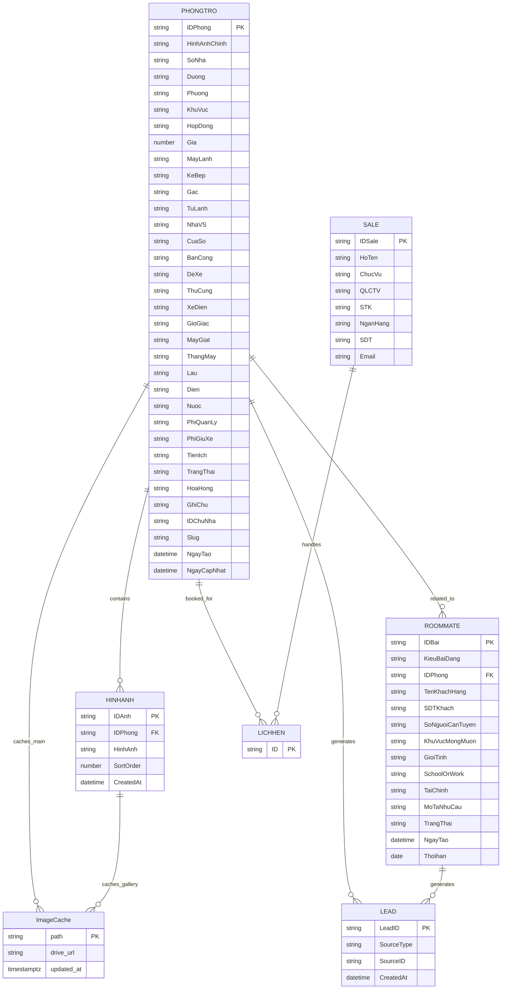

# ERD V4

## Overview

Entity Relationship Diagram cho hệ thống tìm phòng trọ và tìm người ở ghép.

Database: Supabase (PostgreSQL) — migrated từ Google Sheet.

---

# Mermaid ERD

---

# Ghi chú thay đổi

| Version | Ngày | Thay đổi |
|---------|------|----------|
| V1 | 2026-06-13 | Thiết kế ban đầu (Google Sheet + Apps Script) |
| V2 | 2026-06-16 | Đồng bộ với Google Sheet thật |
| V3 | 2026-06-23 | Migrate lên Supabase, thêm ImageCache, xoá Apps Script |
| V4 | 2026-06-26 | Sync docs với codebase |
