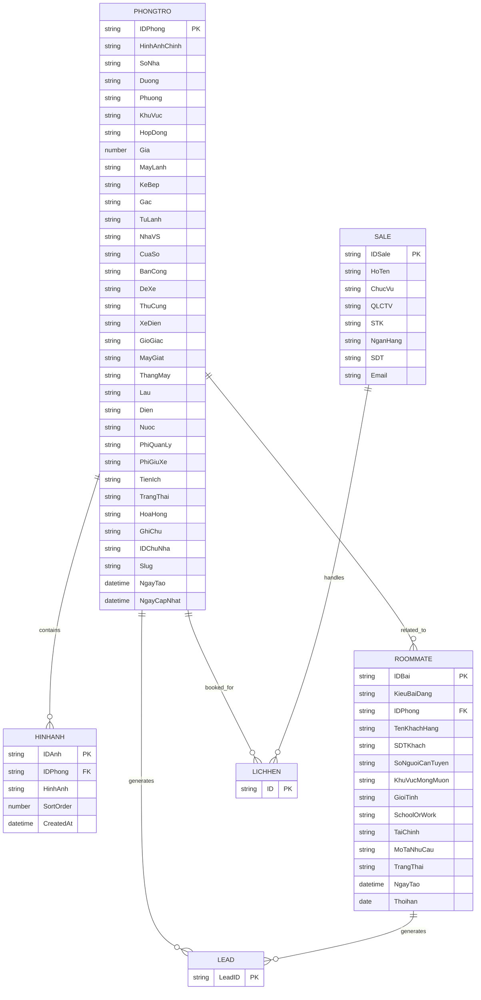

# ERD V2

## Overview

Entity Relationship Diagram cho MVP hệ thống tìm phòng trọ và tìm người ở ghép.

Cập nhật theo Google Sheet thật (DATABASE_HomeMatch).

---

# Mermaid ERD

---

# Ghi chú thay đổi từ V1 -> V2

| Thay đổi | Chi tiết |
|----------|----------|
| PHONGTRO | Thêm: BanCong, ThangMay, Lau, HoaHong, GhiChu, IDChuNha, NgayTao, NgayCapNhat |
| PHONGTRO | Xoá: DienTich, CreatedAt, UpdatedAt |
| PHONGTRO | Boolean -> String (Giá trị Việt: "Có"/"Không"/"Riêng") |
| ROOMMATE | Đổi tên từ ROOMMATE_POST -> ROOMMATE |
| ROOMMATE | Cấu trúc hoàn toàn mới (12 fields tiếng Việt) |
| SALE | Thêm: ChucVu, QLCTV, STK, NganHang |
| HINHANH | Thêm: CreatedAt |
| LICHHEN | Đang chờ xác nhận cấu trúc từ AppSheet |
| LEAD | Đang chờ xác nhận cấu trúc từ AppSheet |
