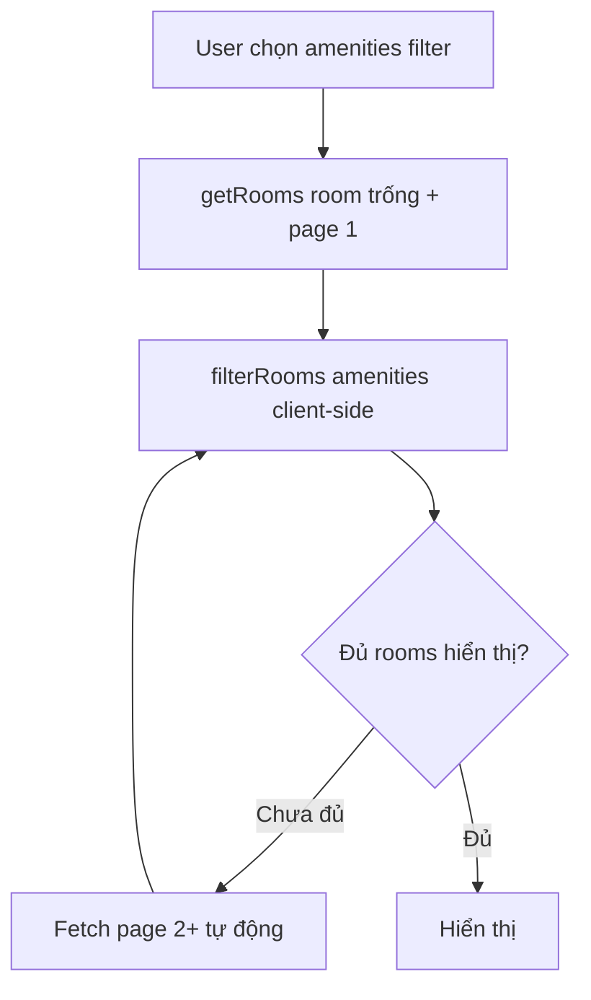

# Rooms Listing Optimization

## Status

- **Phase 1 (Ordering):** Done — triển khai Option B (xem mục 2)
  - ⚠️ **Chữa cháy:** Dùng `idphong DESC` thay `ngaytao`. Chỉ đúng khi ID cùng số chữ số.
  - Nếu ID format thay đổi trong tương lai → chuyển sang Option A (backfill `ngaytao` bằng `ctid`).
- **Phase 2 (Pagination):** Planned — chưa có lịch triển khai
- **Phase 3 (Performance):** Planned — chưa có lịch triển khai

---

## 1. Current Architecture

### Data Flow

```
RoomFilter (client UI params)
  → RoomList state (filterParams)
  → getRooms() called with NO params
    → Supabase: SELECT * FROM phongtro WHERE trangthai = 'Trống'
    → Returns ALL rooms (no limit, no order)
  → filterRooms(rooms, filterParams) — client-side only
  → Render RoomCard[]
```

### Current Constraints

| Aspect | Detail |
|--------|--------|
| Table | `phongtro` (~350 total, ~100-200 active) |
| Sort | None — undefined order |
| Pagination | None — all rooms fetched at once |
| Amenities filter | Client-side only (`every()`) |
| `ngaytao` column | Exists but N/A for existing records |
| `idphong` type | String (AppSheet PK, not sequential) |

---

## 2. Phase 1 — ORDER BY (Đã triển khai)

### Problem

- Existing records: `ngaytao` = NULL
- New records: `ngaytao` sẽ có giá trị thật (qua AppSheet/Supabase)
- Hiện tại không có ordering nào → thứ tự hiển thị ngẫu nhiên

### Giải pháp đã chọn: Option B — ORDER BY idphong DESC

**Lý do chọn Option B (thay vì A):**
- `idphong` là string 13 chữ số, cùng độ dài → PostgreSQL string sort hoạt động giống numeric sort
- Không cần chạy SQL backfill nào
- Thay đổi tối thiểu: chỉ 1 dòng `.order("idphong", { ascending: false })` trong `getRooms()`

**Code change:**

| File | Change |
|------|--------|
| `src/types/room.ts` | Thêm `createdAt: string` vào `Room` type (dự phòng) |
| `src/services/room.service.ts` | Map `ngaytao` → `createdAt` trong `mapRoom()` (dự phòng) |
| `src/services/room.service.ts` | `.order("idphong", { ascending: false })` — chữa cháy |

### ⚠️ Lưu ý: Đây là giải pháp CHỮA CHÁY

| Điều kiện | Kết quả |
|-----------|---------|
| `idphong` cùng số chữ số (hiện tại: 13) | ✅ ORDER BY hoạt động đúng |
| `idphong` khác số chữ số (VD: "1" và "100") | ❌ String sort sai: "9" > "100" |
| AppSheet thay đổi format ID | ❌ Cần kiểm tra lại |

**Khi nào cần chuyển sang Option A:** Nếu AppSheet thay đổi format ID hoặc ID không còn cùng độ dài.

### Option A — Dự phòng (Backfill ngaytao bằng ctid)

Nếu Option B không còn phù hợp, dùng SQL backfill này:

```sql
WITH numbered AS (
  SELECT ctid, row_number() OVER (ORDER BY ctid) as rn
  FROM phongtro WHERE ngaytao IS NULL
)
UPDATE phongtro p
SET ngaytao = NOW() - (numbered.rn * INTERVAL '1 second')
FROM numbered
WHERE p.ctid = numbered.ctid;
```

**Cách hoạt động:**
- `ctid` = physical location ≈ thứ tự insert (dòng cuối = ctid lớn nhất)
- `rn` lớn = timestamp gần NOW nhất → lên đầu ORDER BY DESC
- Sau đó đổi ORDER BY về `ngaytao`

**Hạn chế:** `ctid` thay đổi sau VACUUM/UPDATE, nhưng chỉ cần chạy 1 lần để backfill.

### Why Not Other Approaches

| Approach | Why Not |
|----------|---------|
| ORDER BY `ngaytao DESC NULLS LAST` | Không backfill: `NULLS LAST` đẩy hết existing records xuống cuối, thứ tự giữa chúng undefined | 
| Thêm `sort_order` column | Over-engineering cho data volume hiện tại |

---

## 3. Phase 2 — Pagination (Future)

### When to Implement

- Khi active rooms >500 **hoặc** có complaint về tốc độ tải/ render DOM
- Hiện tại (~100-200 rooms) chưa cần — React Query cache + virtual DOM handle tốt

### Architecture Decision

**Chọn: Offset-based pagination với giới hạn hợp lý**

Lý do không dùng cursor-based:
- Cursor-based phức tạp hơn, cần server-state tracking
- Data volume nhỏ (hàng trăm, không phải hàng triệu records) — offset performance không phải vấn đề
- Supabase `.range()` hỗ trợ offset rất đơn giản
- UX "Load more" / "Xem thêm" trực quan hơn cursor cho non-technical users

### Implementation Plan

#### Approach A: Load More button (recommended)

```
getRooms(params?, page: number, pageSize: number)
  → .range((page - 1) * pageSize, page * pageSize - 1)
  → RoomList uses useInfiniteQuery
  → "Xem thêm" button at bottom of list
```

**Required changes:**

| File | Change |
|------|--------|
| `room.service.ts` | `getRooms()` thêm params `page: number, pageSize: number` → `.range()` |
| `room.service.ts` | Count total matching rooms → return `{ data: Room[], total: number }` |
| `RoomList.tsx` | Replace `useQuery` với `useInfiniteQuery` |
| `RoomList.tsx` | Thêm "Xem thêm" button (hoặc IntersectionObserver cho infinite scroll) |
| `RoomFilterParams` type | Có thể thêm `page`, `pageSize` nếu filter server-side |

#### Challenge: amenities filter + pagination

Amenities filter đang ở client-side. Nếu kết hợp với pagination:



**Giải pháp:** Khi amenities filter được chọn, `useInfiniteQuery` sẽ fetch từng page cho đến khi tìm đủ rooms hoặc hết data. Hiển thị loading indicator cho page tiếp theo.

```typescript
// Pseudo-code
const { data, fetchNextPage, hasNextPage } = useInfiniteQuery({
  queryKey: ['rooms', filterParams],
  queryFn: ({ pageParam = 0 }) => getRooms({
    ...filterParams,
    offset: pageParam * PAGE_SIZE,
    limit: PAGE_SIZE,
  }),
  getNextPageParam: (lastPage, pages) => {
    const totalFetched = pages.reduce((sum, p) => sum + p.data.length, 0);
    return totalFetched < lastPage.total ? pages.length : undefined;
  },
});

const filteredRooms = useMemo(() => {
  const all = data?.pages.flatMap(p => p.data) ?? [];
  return filterRooms(all, filterParams); // amenities filter vẫn client-side
}, [data, filterParams]);
```

#### Page Size Decision

| Device | Cards/row | Suggested page size | Rows per page |
|--------|-----------|---------------------|---------------|
| Mobile | 1 | 6 | ~6 rows (full viewport) |
| Tablet | 2 | 12 | ~6 rows |
| Desktop | 3 | 15-18 | ~5-6 rows |

**Recommendation:** `PAGE_SIZE = 12` — works well across devices, consistent UX.

---

## 4. Phase 3 — Advanced Performance (Future)

### 4.1 Server-side amenities filter

Nếu amenities filter cần chính xác 100%, giữ nguyên client-side. Nhưng nếu cần tốc độ (khi data lớn), có thể thêm gần đúng:

```typescript
// room.service.ts — gần đúng ở Supabase
if (params.amenities?.length) {
  // Filter những room có ÍT NHẤT 1 amenities được chọn (Supabase)
  // Sau đó client-side filterAgain() để lọc chính xác (ALL)
  const conditions = params.amenities.map(key => `${key}.ilike.%có%`);
  query = query.or(conditions.join(','));
}
```

### 4.2 Composite Index

```sql
CREATE INDEX idx_phongtro_trangthai_ngaytao ON phongtro (trangthai, ngaytao DESC);
```

Cover index cho query phổ biến nhất: `WHERE trangthai = 'Trống' ORDER BY ngaytao DESC`.

### 4.3 Database-side count caching

```sql
-- Materialized view nếu cần realtime count
CREATE MATERIALIZED VIEW mv_room_counts AS
SELECT COUNT(*) as total, khuvuc FROM phongtro
WHERE trangthai = 'Trống' GROUP BY khuvuc;
```

Không cần cho data volume hiện tại.

---

## 5. Decision Log

| Date | Decision | Rationale |
|------|----------|-----------|
| 2026-06-24 | **Option B** — `ORDER BY idphong DESC` (chữa cháy) | `idphong` 13 chữ số cùng độ dài → string sort = numeric sort; không cần backfill |
| 2026-06-24 | Chọn offset-based pagination (Phase 2) | Data volume nhỏ, Supabase hỗ trợ sẵn `.range()`, đơn giản hơn cursor |
| 2026-06-24 | Giữ amenities filter client-side | Chính xác hơn, data volume hiện tại không cần server-side |
| 2026-06-24 | PAGE_SIZE = 12 | Balance giữa số lần fetch và số rows hiển thị trên mọi device |
| 2026-06-24 | Xoá `keyword` khỏi code (type + service) | Có backend nhưng không UI, không dùng đến |
| 2026-06-24 | Xoá `dienTichMin` khỏi type | Dead code, không UI không logic |

---

## 6. References

- `src/services/room.service.ts` — Current service layer
- `src/components/room/RoomList.tsx` — Consumer component
- `src/types/room.ts` — Type definitions
- `docs/database_structure.md` — DB schema
- `docs/diagrams/erd-v1.md` — ERD
