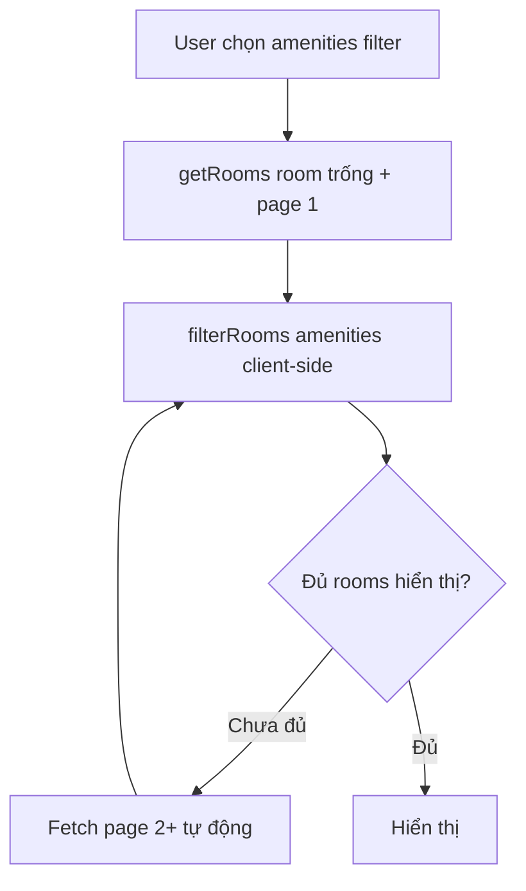

# Rooms Listing Optimization

## Status

- **Phase 1 (Ordering):** Pending — chờ review plan, sẽ triển khai sau khi xác nhận
- **Phase 2 (Pagination):** Planned — chưa có lịch triển khai
- **Phase 3 (Performance):** Planned — chưa có lịch triển khai

---

## 1. Current Architecture

### Data Flow

```
RoomFilter (client UI params)
  → RoomList state (filterParams)
  → getRooms() called with NO params
    → Supabase: SELECT * FROM phongtro WHERE trangthai = 'Trống'
    → Returns ALL rooms (no limit, no order)
  → filterRooms(rooms, filterParams) — client-side only
  → Render RoomCard[]
```

### Current Constraints

| Aspect | Detail |
|--------|--------|
| Table | `phongtro` (~350 total, ~100-200 active) |
| Sort | None — undefined order |
| Pagination | None — all rooms fetched at once |
| Amenities filter | Client-side only (`every()`) |
| `ngaytao` column | Exists but N/A for existing records |
| `idphong` type | String (AppSheet PK, not sequential) |

---

## 2. Phase 1 — ORDER BY ngaytao DESC (Immediate)

### Problem

- Existing records: `ngaytao` = NULL
- New records: `ngaytao` sẽ có giá trị thật (qua AppSheet/Supabase)
- Hiện tại không có ordering nào → thứ tự hiển thị ngẫu nhiên

### Solution

#### Step 1: Backfill existing records

Chạy SQL một lần trên Supabase Dashboard → SQL Editor:

```sql
UPDATE phongtro SET ngaytao = NOW() WHERE ngaytao IS NULL;
```

**Lý do:** Existing records không có timestamp, nhưng đây đều là dữ liệu đang hoạt động ("data mới nhất"). Set đồng loạt về NOW() để chúng có cùng baseline. Future records có `ngaytao` thật sẽ tự động lên đầu khi ORDER BY DESC.

#### Step 2: Code changes

| File | Change |
|------|--------|
| `src/types/room.ts` | Thêm `createdAt: string` vào `Room` type |
| `src/services/room.service.ts` | Map `ngaytao` → `createdAt` trong `mapRoom()` |
| `src/services/room.service.ts` | Thêm `.order("ngaytao", { ascending: false })` trong `getRooms()` |

#### Step 3: Verify

- **Ordering:** Rooms hiển thị newest-first (future = real timestamp, existing = backfill time)
- **Performance:** Single column ORDER BY trên indexed column = O(log n), không ảnh hưởng tốc độ
- **Edge case:** Records cùng `ngaytao` (toàn bộ existing) sẽ có thứ tự undefined giữa chúng — chấp nhận được vì existing data không có thông tin thời gian

### Why Not Alternative Approaches

| Approach | Why Not |
|----------|---------|
| ORDER BY `idphong` DESC | `idphong` là string không sequential (AppSheet PK) → lexicographic sort sai thứ tự |
| ORDER BY `ngaytao DESC NULLS LAST` | Không backfill: `NULLS LAST` đẩy hết existing records xuống cuối, thứ tự giữa chúng undefined, nhưng future records sẽ lên đầu. Tuy nhiên không backfill đồng nghĩa không có thứ tự nào cho existing data — backfill 1 lần là fix gọn | 
| Thêm `sort_order` column | Over-engineering cho data volume hiện tại |

---

## 3. Phase 2 — Pagination (Future)

### When to Implement

- Khi active rooms >500 **hoặc** có complaint về tốc độ tải/ render DOM
- Hiện tại (~100-200 rooms) chưa cần — React Query cache + virtual DOM handle tốt

### Architecture Decision

**Chọn: Offset-based pagination với giới hạn hợp lý**

Lý do không dùng cursor-based:
- Cursor-based phức tạp hơn, cần server-state tracking
- Data volume nhỏ (hàng trăm, không phải hàng triệu records) — offset performance không phải vấn đề
- Supabase `.range()` hỗ trợ offset rất đơn giản
- UX "Load more" / "Xem thêm" trực quan hơn cursor cho non-technical users

### Implementation Plan

#### Approach A: Load More button (recommended)

```
getRooms(params?, page: number, pageSize: number)
  → .range((page - 1) * pageSize, page * pageSize - 1)
  → RoomList uses useInfiniteQuery
  → "Xem thêm" button at bottom of list
```

**Required changes:**

| File | Change |
|------|--------|
| `room.service.ts` | `getRooms()` thêm params `page: number, pageSize: number` → `.range()` |
| `room.service.ts` | Count total matching rooms → return `{ data: Room[], total: number }` |
| `RoomList.tsx` | Replace `useQuery` với `useInfiniteQuery` |
| `RoomList.tsx` | Thêm "Xem thêm" button (hoặc IntersectionObserver cho infinite scroll) |
| `RoomFilterParams` type | Có thể thêm `page`, `pageSize` nếu filter server-side |

#### Challenge: amenities filter + pagination

Amenities filter đang ở client-side. Nếu kết hợp với pagination:



**Giải pháp:** Khi amenities filter được chọn, `useInfiniteQuery` sẽ fetch từng page cho đến khi tìm đủ rooms hoặc hết data. Hiển thị loading indicator cho page tiếp theo.

```typescript
// Pseudo-code
const { data, fetchNextPage, hasNextPage } = useInfiniteQuery({
  queryKey: ['rooms', filterParams],
  queryFn: ({ pageParam = 0 }) => getRooms({
    ...filterParams,
    offset: pageParam * PAGE_SIZE,
    limit: PAGE_SIZE,
  }),
  getNextPageParam: (lastPage, pages) => {
    const totalFetched = pages.reduce((sum, p) => sum + p.data.length, 0);
    return totalFetched < lastPage.total ? pages.length : undefined;
  },
});

const filteredRooms = useMemo(() => {
  const all = data?.pages.flatMap(p => p.data) ?? [];
  return filterRooms(all, filterParams); // amenities filter vẫn client-side
}, [data, filterParams]);
```

#### Page Size Decision

| Device | Cards/row | Suggested page size | Rows per page |
|--------|-----------|---------------------|---------------|
| Mobile | 1 | 6 | ~6 rows (full viewport) |
| Tablet | 2 | 12 | ~6 rows |
| Desktop | 3 | 15-18 | ~5-6 rows |

**Recommendation:** `PAGE_SIZE = 12` — works well across devices, consistent UX.

---

## 4. Phase 3 — Advanced Performance (Future)

### 4.1 Server-side amenities filter

Nếu amenities filter cần chính xác 100%, giữ nguyên client-side. Nhưng nếu cần tốc độ (khi data lớn), có thể thêm gần đúng:

```typescript
// room.service.ts — gần đúng ở Supabase
if (params.amenities?.length) {
  // Filter những room có ÍT NHẤT 1 amenities được chọn (Supabase)
  // Sau đó client-side filterAgain() để lọc chính xác (ALL)
  const conditions = params.amenities.map(key => `${key}.ilike.%có%`);
  query = query.or(conditions.join(','));
}
```

### 4.2 Composite Index

```sql
CREATE INDEX idx_phongtro_trangthai_ngaytao ON phongtro (trangthai, ngaytao DESC);
```

Cover index cho query phổ biến nhất: `WHERE trangthai = 'Trống' ORDER BY ngaytao DESC`.

### 4.3 Database-side count caching

```sql
-- Materialized view nếu cần realtime count
CREATE MATERIALIZED VIEW mv_room_counts AS
SELECT COUNT(*) as total, khuvuc FROM phongtro
WHERE trangthai = 'Trống' GROUP BY khuvuc;
```

Không cần cho data volume hiện tại.

---

## 5. Decision Log

| Date | Decision | Rationale |
|------|----------|-----------|
| 2026-06-24 | Backfill `ngaytao` = NOW() cho existing records | Tạo baseline ordering, future records tự động lên đầu |
| 2026-06-24 | Chọn offset-based pagination (Phase 2) | Data volume nhỏ, Supabase hỗ trợ sẵn `.range()`, đơn giản hơn cursor |
| 2026-06-24 | Giữ amenities filter client-side | Chính xác hơn, data volume hiện tại không cần server-side |
| 2026-06-24 | PAGE_SIZE = 12 | Balance giữa số lần fetch và số rows hiển thị trên mọi device |

---

## 6. References

- `src/services/room.service.ts` — Current service layer
- `src/components/room/RoomList.tsx` — Consumer component
- `src/types/room.ts` — Type definitions
- `docs/database_structure.md` — DB schema
- `docs/diagrams/erd-v1.md` — ERD
